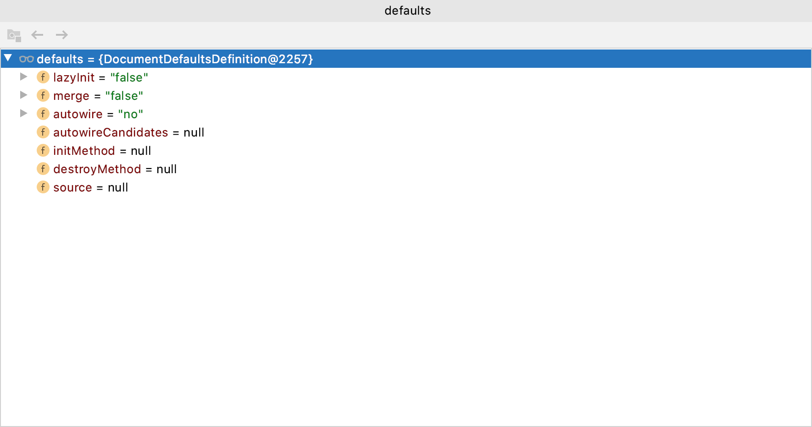

#  Spring源码解读

```java
ApplicationContext context = new ClassPathXmlApplicationContext("ioc.xml");
```

从这段代码开始，主要类依次出场：

## ClassPathXmlApplicationContext

构造方法super(parent);

## AbstractApplicationContext

### PathMatchingResourcePatternResolver

```java
// 一直调用父类的构造方法，直到AbstractApplicationContext
this.resourcePatternResolver = new PathMatchingResourcePatternResolver(this);
```

## AbstractRefreshableConfigApplicationContext

```java
//调用父类AbstractRefreshableConfigApplicationContext方法设置configLocations
this.configLocations = new String[locations.length];
```

refresh();

调用父类AbstractApplicationContext中的refresh()方法

```java
ConfigurableListableBeanFactory beanFactory = obtainFreshBeanFactory();
```

## AbstractRefreshableApplicationContext

```java
// 创建IOC容器中的BeanFactory，并对BeanFactory进行赋值
DefaultListableBeanFactory beanFactory = createBeanFactory();
beanFactory.setSerializationId(getId());
customizeBeanFactory(beanFactory);
```

### DefaultListableBeanFactory

```java
// 主要方法，开始加载bean的定义
loadBeanDefinitions(beanFactory);
```

## AbstractXmlApplicationContext

由AbstractXmlApplicationContext类来执行具体的loadBeanDefinitions方法，创建XmlBeanDefinitionReader

```java
XmlBeanDefinitionReader beanDefinitionReader = new XmlBeanDefinitionReader(beanFactory);
beanDefinitionReader.setEnvironment(this.getEnvironment());
// 设置ResourceLoader为当前ClassPathXmlApplicationContext
beanDefinitionReader.setResourceLoader(this);
// 设置EntityResolver为ResourceEntityResolver(当前ClassPathXmlApplicationContext)
beanDefinitionReader.setEntityResolver(new ResourceEntityResolver(this));
beanDefinitionReader.loadBeanDefinitions(configLocations);
```

### XmlBeanDefinitionReader

#### ResourceLoader

#### EntityResolver

### AbstractBeanDefinitionReader

```java
//  XmlBeanDefinitionReader类在执行loadBeanDefinitions方法，会调用父类方法
beanDefinitionReader.loadBeanDefinitions(configLocations);
```

#### Resource

```java
// 根据前面设置的resourceLoader就是当前ClassPathXmlApplicationContext
// getReources，通过设置的resourcePatternResolver取得Resource
Resource[] resources = ((ResourcePatternResolver) resourceLoader).getResources(location);
// 读取resource，加载beanDefinitions，由XmlBeanDefnitionReader实现
loadBeanDefinitions(resource);
```

### XmlBeanDefinitionReader

```java
try (InputStream inputStream = encodedResource.getResource().getInputStream()) {
			InputSource inputSource = new InputSource(inputStream);
			if (encodedResource.getEncoding() != null) {
				inputSource.setEncoding(encodedResource.getEncoding());
			}
			return doLoadBeanDefinitions(inputSource, encodedResource.getResource());
		}
// do方法，开始执行具体的加载
doLoadBeanDefinitions()
```

#### Document

#### DefaultDocumentReader

#### DocumentBuilderFactory

#### DocumentBuilder

```java
// 读取resource
Document doc = doLoadDocument(inputSource, resource);
// 根据读取的Document注册beanDefinitions
registerBeanDefinitions(Document Doc, Resource resource)
```

#### BeanDefinitionDocumentReader

```java
BeanDefinitionDocumentReader documentReader = createBeanDefinitionDocumentReader();
documentReader.registerBeanDefinitions(doc, createReaderContext(resource));
```

##### XmlReaderContext

#### DefaultBeanDefinitionDocumentReader

```java
// 创建BeanDefinitionParserDelegate对象
protected void doRegisterBeanDefinitions(Element root);
protected void parseBeanDefinitions(Element root, BeanDefinitionParserDelegate delegate);
```

##### BeanDefinitionParserDelegate

###### DocumentDefaultsDefinition



```java
// 读取具体的元素后
processBeanDefinition(ele, delegate);
// 由delegate来解析定义的元素
BeanDefinitionHolder bdHolder = delegate.parseBeanDefinitionElement(ele);
```

```java
// 在Delegate类中
AbstractBeanDefinition beanDefinition = parseBeanDefinitionElement(ele, beanName, containingBean);
// BeanDefinitionHolder对象包装了beanDefinition
new BeanDefinitionHolder(beanDefinition, beanName, aliasesArray);
```

###### BeanDefinitionHolder

###### AbstractBeanDefinition

##### BeanDefinitionReaderUtils

```java 
// 在由BeanDefinitionParserDelegate解析了配置文件中的具体元素后，由BeanDefinitionReaderUtils进行注册。
BeanDefinitionReaderUtils.registerBeanDefinition(bdHolder, getReaderContext().getRegistry());
```

```java
// DefaultListableBeanFactory.java
// 这里的registry就是DefaultListableBeanFactory，注册过程中，调回到DefaultListableBeanFactory类中
this.beanDefinitionMap.put(beanName, beanDefinition);
this.beanDefinitionNames.add(beanName);
```

```java
// AbstractApplicationContext.java
public void refresh() {
  // 到此处，obtainFreshBeanFactory()方法执行完成。
  ConfigurableListableBeanFactory beanFactory = obtainFreshBeanFactory();
}
```

